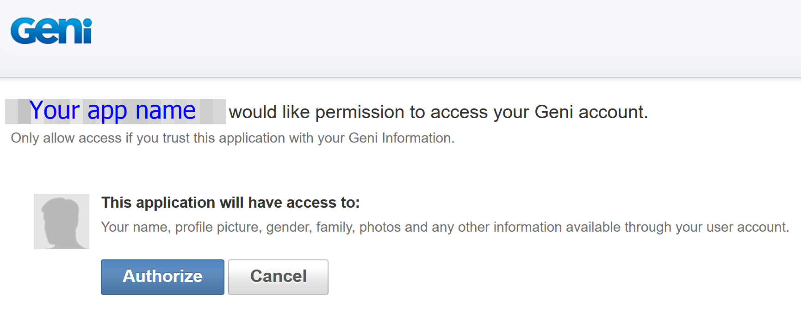
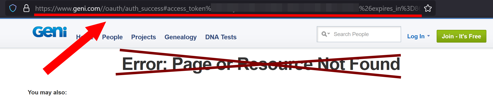

# Geni: Python Client Library for Geni.com Public REST API

This library simplifies interaction with the [Geni.com public REST API](https://www.geni.com/platform/developer/index), enabling developers to automate various family tree management tasks or integrate Geni functionality into their Python applications. In particular, to post process your family tree after the GEDCOM import.

## Features
- Simplifies API interaction.
- Implements OAuth authentication flow.
- Handles Geni required rate limiting.
- Stores API keys and tokens for ease of use.
- Provides examples for common use cases.

## Installation
```bash
pip install git+https://github.com/bryndin/geni.git
```

## Implemented Methods
The library currently supports the following methods:

* **Profile**
  - [profile](https://www.geni.com/platform/developer/help/api?path=profile): Returns information about a profile. 
  - [delete](https://www.geni.com/platform/developer/help/api?path=profile%2Fdelete): Deletes a profile.
  - [update_basics](https://www.geni.com/platform/developer/help/api?path=profile%2Fupdate-basics): Update fields on the basics and about tabs and return the changed profile. Parameters can be posted as form data or JSON.
* **Stats**
  - [stats](https://www.geni.com/platform/developer/help/api?path=stats): Returns information about the site.
  - [world_family_tree](https://www.geni.com/platform/developer/help/api?path=stats%2Fworld-family-tree): Returns info about the world family tree.
* **User**
  - [managed_profiles](https://www.geni.com/platform/developer/help/api?path=user%2Fmanaged-profiles): Returns a list of profiles the user manages.

Additional methods are planned for future releases. Contributions are welcome!

[//]: # (## Example Scripts)

[//]: # (Here are some usage examples:)

[//]: # ()
[//]: # (### Fetching User Profile)

[//]: # (```python)

[//]: # (from geni import GeniClient)

[//]: # ()
[//]: # (client = GeniClient&#40;&#41;)

[//]: # (client.authenticate&#40;&#41;)

[//]: # (profile = client.get_user_profile&#40;&#41;)

[//]: # (print&#40;profile&#41;)

[//]: # (```)

[//]: # ()
[//]: # (### Searching for Profiles)

[//]: # (```python)

[//]: # (results = client.search_profiles&#40;"John Doe"&#41;)

[//]: # (for profile in results:)

[//]: # (    print&#40;profile["name"], profile["id"]&#41;)

[//]: # (```)

[//]: # ()
[//]: # (### Adding a Photo)

[//]: # (```python)

[//]: # (client.add_photo&#40;profile_id="123456789", file_path="/path/to/photo.jpg"&#41;)

[//]: # (```)

## Authentication
To interact with the Geni API, you need to authenticate using OAuth 2.0. Follow these steps:

1. Register your application at [Geni.com App Registration](https://www.geni.com/platform/developer/help/oauth_extensions).
2. Copy your API Key.
3. Make your key available in one of the following ways:
    - Store your API Key in a file named `geni_api.key` in your working directory,
      
    - or pass your API key as a parameter during the library initialization.
4. During the first run, you will be prompted to authorize your application:
   1. In the terminal window the library will give you the URL to Geni Auth page
    ```
    Visit this URL to authorize the application:
    https://www.geni.com/platform/oauth/authorize?client_id=XXXXXXXX&response_type=token&display=desktop
    Paste the redirect URL (from the address bar):
    ```
   2. Open it in any browser and authorize your application in Geni.
    
   3. Geni will redirect you to the next page. Ignore the "Not Found" message there, copy the entire URL from **the browser address bar** and paste it in the terminal.
    
   4. The library will extract the access token from that redirected URL and save it to a temporary file `geni_token.tmp`.
5. Each subsequent request will use the access token from the temporary file, until the token expires or the file is manually removed.
6. If the access token is expired, the library will ask you to re-authenticate before continuing with the request (expiration time is also stored in the temporary file).

## Sensitive files
The library uses two files:

- **`geni_api.key`**: Created manually to store your API key.
- **`geni_token.tmp`**: Created by the library to store the temporary API access token.

Ensure these files are secured and not exposed in version control systems. You have to manually delete them when done.

## License
This project is licensed under the MIT License. See the [LICENSE](./LICENSE) file for details.

